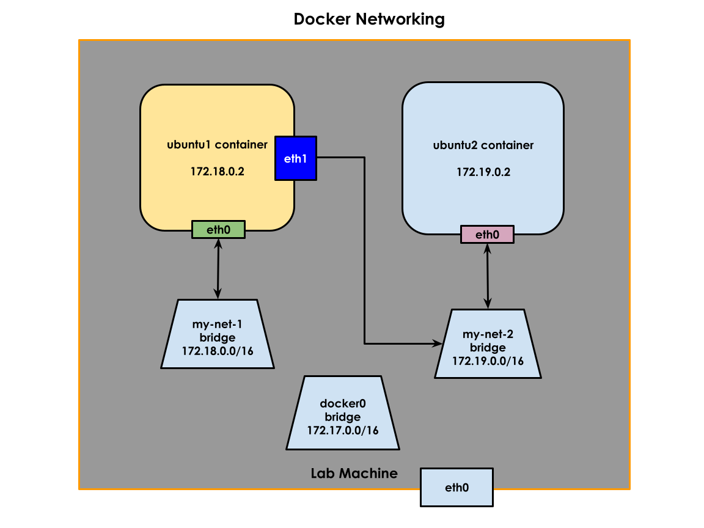

# Day5

## Docker Network Model
- Docker supports the below types of Network
  1. bridge
  2. host
  3. none
- by default, all containers are added to bridge network
- the bridge network has a subnet 172.17.0.0/16 and the bridge will act like a gateway(172.17.0.1) for all docker containers

## Listing the network types supported by docker
```
docker network ls
```
Expected output
<pre>
(jegan@tektutor.org)$ <b>docker network ls</b>
NETWORK ID     NAME      DRIVER    SCOPE
df0f5f7c81cf   bridge    bridge    local
9371e925f813   host      host      local
7c9fa6ea53f0   none      null      local
</pre>

#### Docker Network Model - Points to remember
- every time a new container is created, if no custom network is mentioned, the container will be connected to docker0 bridge network
- the Docker container get's a Private IP from the 172.17.0.0/16 that is available
- when a new container is created, Docker Application Engine creates a pair of veth interfaces
- one end of the veth interface is connected inside the container, which is seen as eth0 Network Interface Card(NIC) by the container
- other end of the veth interface is connected to the docker0 bridge. This can be seen using ifconfig command on the localhost where docker is installed
- every docker container has a dedicated network stack ( 7 OSI Layers )
- every docker container has a IP Routing Table
- the IP Routing Table is used by Docker to forward network packets for any outbound traffic from container

#### Finding more details about bridge device
```
docker network inspect bridge
```

Expected output
<pre>
(jegan@tektutor.org)$ <b>docker network inspect bridge</b>
[
    {
        "Name": "bridge",
        "Id": "df0f5f7c81cf25494c9d446913eaf5a1acec94ee69bc38ad98ea3bc6bcee073e",
        "Created": "2022-07-14T20:17:13.057160332+05:30",
        "Scope": "local",
        "Driver": "bridge",
        "EnableIPv6": false,
        "IPAM": {
            "Driver": "default",
            "Options": null,
            "Config": [
                {
                    "Subnet": "172.17.0.0/16",
                    "Gateway": "172.17.0.1"
                }
            ]
        },
        "Internal": false,
        "Attachable": false,
        "Ingress": false,
        "ConfigFrom": {
            "Network": ""
        },
        "ConfigOnly": false,
        "Containers": {},
        "Options": {
            "com.docker.network.bridge.default_bridge": "true",
            "com.docker.network.bridge.enable_icc": "true",
            "com.docker.network.bridge.enable_ip_masquerade": "true",
            "com.docker.network.bridge.host_binding_ipv4": "0.0.0.0",
            "com.docker.network.bridge.name": "docker0",
            "com.docker.network.driver.mtu": "1500"
        },
        "Labels": {}
    }
]
</pre>

#### Creating a custom network my-net-1
```
docker network create my-net-1 --subnet 172.18.0.0/16
```
Expected output
<pre>
(jegan@tektutor.org)$ <b>docker network create my-net-1 --subnet 172.18.0.0/16</b>
73aadf83287bd494c9cb43eda2d3d61bb7dcee30e01f217c0389146db520ea7c
</pre>

#### Creating a custom network my-net-2
```
docker network create my-net-2 --subnet 172.19.0.0/16
```
Expected output
<pre>
(jegan@tektutor.org)$ <b>docker network create my-net-2 --subnet 172.19.0.0/16</b>
0d8127f235c403fb99d0778e93c96db1054ed1ca6acb01d147898ae42320d087
</pre>

#### Create a new ubuntu1 container and connect it to my-net-1 network
```
docker run -dit --name ubuntu1 --hostname ubuntu1 --network my-net-1 ubuntu:16.04 /bin/bash
```
Expected output
<pre>
(jegan@tektutor.org)$ <b>docker run -dit --name ubuntu1 --hostname ubuntu1 --network my-net-1 ubuntu:16.04 /bin/bash</b>
e2980aefc095823b4074f594e4e8ab9c91470b9e9be261d697efc10c4912baa7
</pre>

#### Create a new ubuntu2 container and connect it to my-net-2 network
```
docker run -dit --name ubuntu2 --hostname ubuntu2 --network my-net-2 ubuntu:16.04 /bin/bash
```
Expected output
<pre>
(jegan@tektutor.org)$<b>docker run -dit --name ubuntu2 --hostname ubuntu2 --network my-net-2 ubuntu:16.04 /bin/bash</b>
e8b3a9148948f5d7ace8f32d6dfe904b9cd0ab56366a437c1009e463d2620e6d
</pre>

#### Connect ubuntu1 container to my-net-2 as well
```
docker network connect my-net-2 ubuntu1
```
Expected output
<pre>
(jegan@tektutor.org)$ <b>docker network connect my-net-2 ubuntu1</b>
</pre>




#### Inspect ubuntu1 and see the IP address
```
docker inspect ubuntu1 | grep IPA
```

Expected output
<pre>
(jegan@tektutor.org)$ docker inspect ubuntu1|grep IPA
            "SecondaryIPAddresses": null,
            "IPAddress": "",
                    "IPAMConfig": null,
                    "IPAddress": "172.18.0.2",
                    "IPAMConfig": {},
                    "IPAddress": "172.19.0.3",
</pre>
ubuntu1 container has two IP addresses as it is connected to 2 networks, it has 2 Network Interface Cards(NICs).

#### Try getting inside the ubuntu1 container and install some network tools
```
docker exec -it ubuntu1 bash
```

Expected output
<pre>
(jegan@tektutor.org)$ <b>docker exec -it ubuntu1 bash</b>
root@ubuntu1:/# <b>apt update && apt install iputils-ping net-tools</b>
Get:1 http://security.ubuntu.com/ubuntu xenial-security InRelease [99.8 kB]
Get:2 http://archive.ubuntu.com/ubuntu xenial InRelease [247 kB]
Get:3 http://security.ubuntu.com/ubuntu xenial-security/main amd64 Packages [2051 kB]
Get:4 http://archive.ubuntu.com/ubuntu xenial-updates InRelease [99.8 kB]         
Get:5 http://archive.ubuntu.com/ubuntu xenial-backports InRelease [97.4 kB]                
Get:6 http://archive.ubuntu.com/ubuntu xenial/main amd64 Packages [1558 kB]                  
Get:7 http://security.ubuntu.com/ubuntu xenial-security/restricted amd64 Packages [15.9 kB] 
Get:8 http://security.ubuntu.com/ubuntu xenial-security/universe amd64 Packages [984 kB]   
Get:9 http://security.ubuntu.com/ubuntu xenial-security/multiverse amd64 Packages [8820 B]
Get:10 http://archive.ubuntu.com/ubuntu xenial/restricted amd64 Packages [14.1 kB]
Get:11 http://archive.ubuntu.com/ubuntu xenial/universe amd64 Packages [9827 kB]
Get:12 http://archive.ubuntu.com/ubuntu xenial/multiverse amd64 Packages [176 kB]
Get:13 http://archive.ubuntu.com/ubuntu xenial-updates/main amd64 Packages [2560 kB]
Get:14 http://archive.ubuntu.com/ubuntu xenial-updates/restricted amd64 Packages [16.4 kB]
Get:15 http://archive.ubuntu.com/ubuntu xenial-updates/universe amd64 Packages [1544 kB]
Get:16 http://archive.ubuntu.com/ubuntu xenial-updates/multiverse amd64 Packages [26.2 kB]
Get:17 http://archive.ubuntu.com/ubuntu xenial-backports/main amd64 Packages [10.9 kB]
Get:18 http://archive.ubuntu.com/ubuntu xenial-backports/universe amd64 Packages [12.7 kB]
Fetched 19.3 MB in 5s (3510 kB/s)                           
Reading package lists... Done
Building dependency tree       
Reading state information... Done
All packages are up to date.
Reading package lists... Done
Building dependency tree       
Reading state information... Done
The following additional packages will be installed:
  libffi6 libgmp10 libgnutls-openssl27 libgnutls30 libhogweed4 libidn11 libnettle6 libp11-kit0 libtasn1-6
Suggested packages:
  gnutls-bin
The following NEW packages will be installed:
  iputils-ping libffi6 libgmp10 libgnutls-openssl27 libgnutls30 libhogweed4 libidn11 libnettle6 libp11-kit0 libtasn1-6 net-tools
0 upgraded, 11 newly installed, 0 to remove and 0 not upgraded.
Need to get 1482 kB of archives.
After this operation, 4510 kB of additional disk space will be used.
<b>Do you want to continue? [Y/n] Y</b>
Get:1 http://archive.ubuntu.com/ubuntu xenial/main amd64 libgmp10 amd64 2:6.1.0+dfsg-2 [240 kB]
Get:2 http://archive.ubuntu.com/ubuntu xenial-updates/main amd64 libnettle6 amd64 3.2-1ubuntu0.16.04.2 [93.7 kB]
Get:3 http://archive.ubuntu.com/ubuntu xenial-updates/main amd64 libhogweed4 amd64 3.2-1ubuntu0.16.04.2 [136 kB]
Get:4 http://archive.ubuntu.com/ubuntu xenial-updates/main amd64 libidn11 amd64 1.32-3ubuntu1.2 [46.5 kB]
Get:5 http://archive.ubuntu.com/ubuntu xenial/main amd64 libffi6 amd64 3.2.1-4 [17.8 kB]
Get:6 http://archive.ubuntu.com/ubuntu xenial-updates/main amd64 libp11-kit0 amd64 0.23.2-5~ubuntu16.04.2 [107 kB]
Get:7 http://archive.ubuntu.com/ubuntu xenial-updates/main amd64 libtasn1-6 amd64 4.7-3ubuntu0.16.04.3 [43.5 kB]
Get:8 http://archive.ubuntu.com/ubuntu xenial-updates/main amd64 libgnutls30 amd64 3.4.10-4ubuntu1.9 [548 kB]
Get:9 http://archive.ubuntu.com/ubuntu xenial-updates/main amd64 libgnutls-openssl27 amd64 3.4.10-4ubuntu1.9 [21.9 kB]
Get:10 http://archive.ubuntu.com/ubuntu xenial/main amd64 iputils-ping amd64 3:20121221-5ubuntu2 [52.7 kB]
Get:11 http://archive.ubuntu.com/ubuntu xenial/main amd64 net-tools amd64 1.60-26ubuntu1 [175 kB]
Fetched 1482 kB in 6s (224 kB/s)                                                                                                                        
debconf: delaying package configuration, since apt-utils is not installed
Selecting previously unselected package libgmp10:amd64.
(Reading database ... 4785 files and directories currently installed.)
Preparing to unpack .../libgmp10_2%3a6.1.0+dfsg-2_amd64.deb ...
Unpacking libgmp10:amd64 (2:6.1.0+dfsg-2) ...
Selecting previously unselected package libnettle6:amd64.
Preparing to unpack .../libnettle6_3.2-1ubuntu0.16.04.2_amd64.deb ...
Unpacking libnettle6:amd64 (3.2-1ubuntu0.16.04.2) ...
Selecting previously unselected package libhogweed4:amd64.
Preparing to unpack .../libhogweed4_3.2-1ubuntu0.16.04.2_amd64.deb ...
Unpacking libhogweed4:amd64 (3.2-1ubuntu0.16.04.2) ...
Selecting previously unselected package libidn11:amd64.
Preparing to unpack .../libidn11_1.32-3ubuntu1.2_amd64.deb ...
Unpacking libidn11:amd64 (1.32-3ubuntu1.2) ...
Selecting previously unselected package libffi6:amd64.
Preparing to unpack .../libffi6_3.2.1-4_amd64.deb ...
Unpacking libffi6:amd64 (3.2.1-4) ...
Selecting previously unselected package libp11-kit0:amd64.
Preparing to unpack .../libp11-kit0_0.23.2-5~ubuntu16.04.2_amd64.deb ...
Unpacking libp11-kit0:amd64 (0.23.2-5~ubuntu16.04.2) ...
Selecting previously unselected package libtasn1-6:amd64.
Preparing to unpack .../libtasn1-6_4.7-3ubuntu0.16.04.3_amd64.deb ...
Unpacking libtasn1-6:amd64 (4.7-3ubuntu0.16.04.3) ...
Selecting previously unselected package libgnutls30:amd64.
Preparing to unpack .../libgnutls30_3.4.10-4ubuntu1.9_amd64.deb ...
Unpacking libgnutls30:amd64 (3.4.10-4ubuntu1.9) ...
Selecting previously unselected package libgnutls-openssl27:amd64.
Preparing to unpack .../libgnutls-openssl27_3.4.10-4ubuntu1.9_amd64.deb ...
Unpacking libgnutls-openssl27:amd64 (3.4.10-4ubuntu1.9) ...
Selecting previously unselected package iputils-ping.
Preparing to unpack .../iputils-ping_3%3a20121221-5ubuntu2_amd64.deb ...
Unpacking iputils-ping (3:20121221-5ubuntu2) ...
Selecting previously unselected package net-tools.
Preparing to unpack .../net-tools_1.60-26ubuntu1_amd64.deb ...
Unpacking net-tools (1.60-26ubuntu1) ...
Processing triggers for libc-bin (2.23-0ubuntu11.3) ...
Setting up libgmp10:amd64 (2:6.1.0+dfsg-2) ...
Setting up libnettle6:amd64 (3.2-1ubuntu0.16.04.2) ...
Setting up libhogweed4:amd64 (3.2-1ubuntu0.16.04.2) ...
Setting up libidn11:amd64 (1.32-3ubuntu1.2) ...
Setting up libffi6:amd64 (3.2.1-4) ...
Setting up libp11-kit0:amd64 (0.23.2-5~ubuntu16.04.2) ...
Setting up libtasn1-6:amd64 (4.7-3ubuntu0.16.04.3) ...
Setting up libgnutls30:amd64 (3.4.10-4ubuntu1.9) ...
Setting up libgnutls-openssl27:amd64 (3.4.10-4ubuntu1.9) ...
Setting up iputils-ping (3:20121221-5ubuntu2) ...
Setcap is not installed, falling back to setuid
Setting up net-tools (1.60-26ubuntu1) ...
Processing triggers for libc-bin (2.23-0ubuntu11.3) ...
</pre>

## OpenShift Network Model
